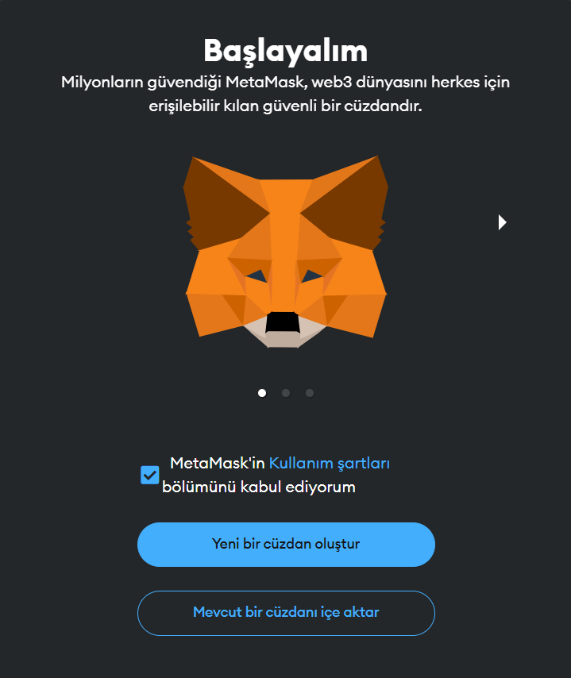
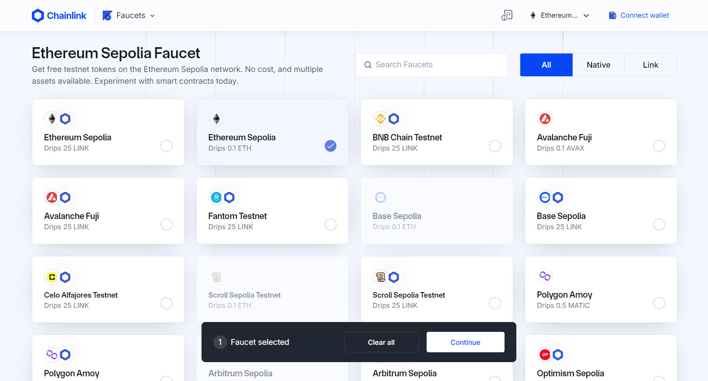
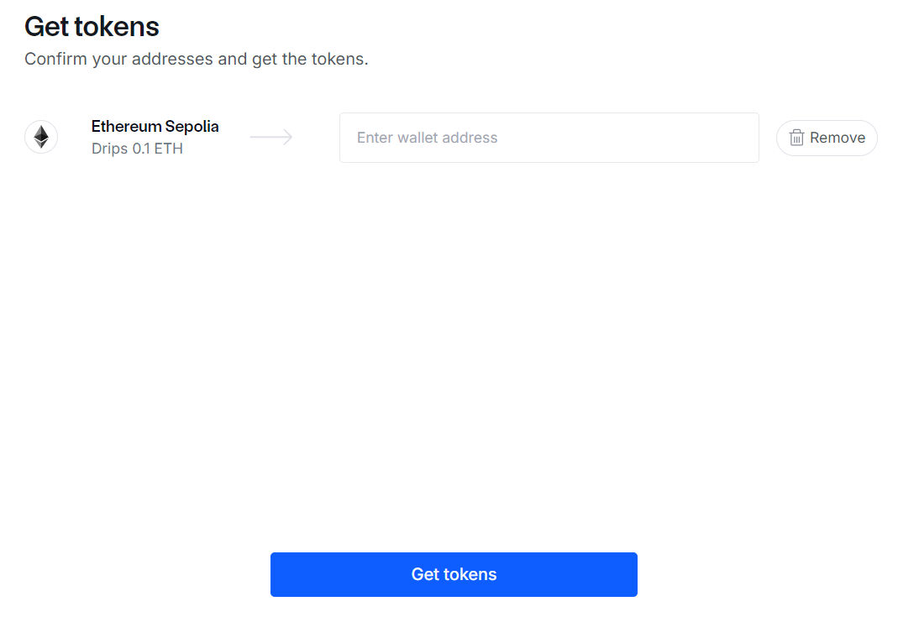
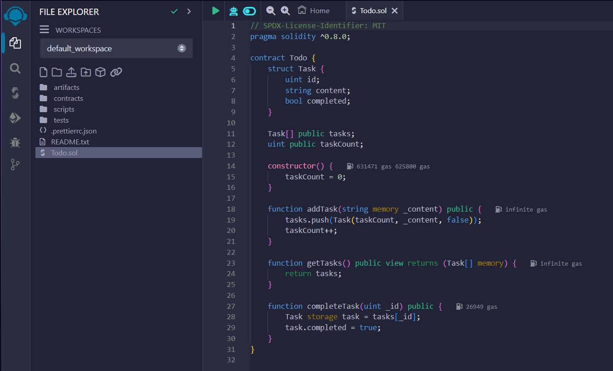
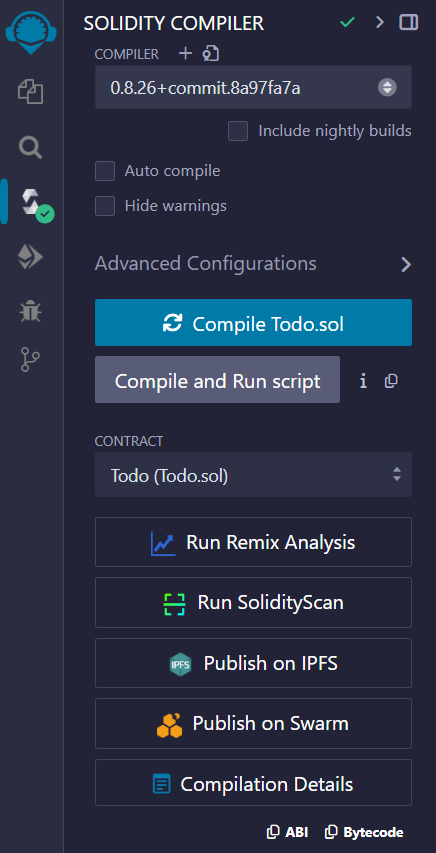
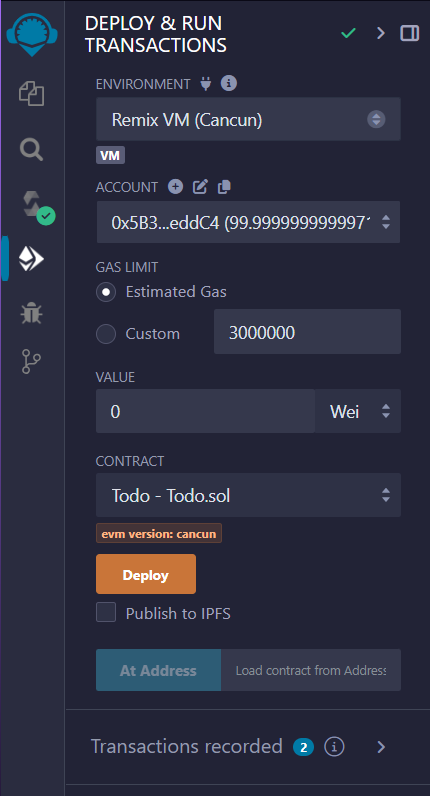
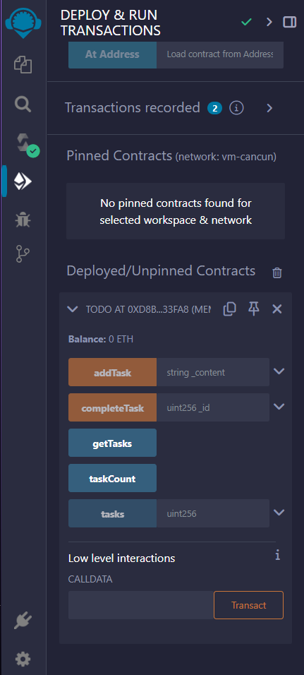
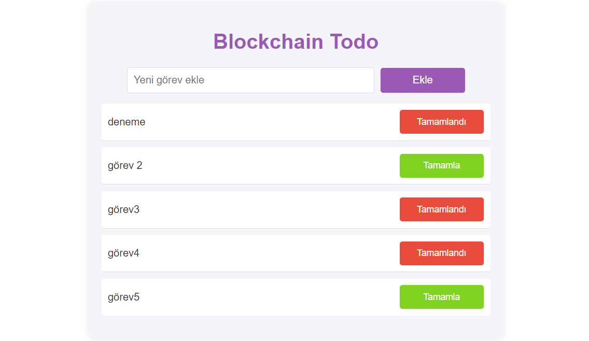

# Blockchain Tabanlı Todo App

Bu proje, Ethereum blockchain ağı üzerinde çalışan bir Todo uygulamasıdır. Kullanıcılar, görevler ekleyebilir, tamamlayabilir ve bu görevlerin durumunu görüntüleyebilir. Uygulama, merkezi olmayan, güvenli ve değiştirilemez bir yapıya sahiptir. Blockchain tabanlı olma gereksinimini sağlamasa da, en basit haliyle akıllı sözleşme yazma ve bunu bir web projesine dahil etme sürecini göstermeyi amaçlar. Bu sayede, blockchain teknolojisinin temellerini anlamak ve uygulama geliştirme aşamalarını deneyimlemek isteyenler için öğretici bir örnek sunar.

## Neden Blockchain?

Blockchain teknolojisi, merkezi olmayan, güvenli ve değiştirilemez bir veri yönetim sistemi sunar. Bu özellikler, özellikle güvenlik ve veri bütünlüğü gerektiren uygulamalar için idealdir.

### Projenin Avantajları ve Dezavantajları

| **Avantajlar**                                                                                     | **Dezavantajlar**                                                                                     |
|-----------------------------------------------------------------------------------------------------|-------------------------------------------------------------------------------------------------------|
| **Değişmezlik (Immutability):** Blockchain üzerinde yapılan işlemler geri alınamaz ve değiştirilemez. | **Maliyet:** Ethereum gibi halka açık Blockchain'lerde yapılan her işlem için gas fee ödenir.        |
| **Güvenlik:** Veriler merkezi olmayan bir ağda saklandığı için daha güvenlidir.                    | **Performans:** Blockchain'ler, geleneksel veritabanlarına göre daha yavaştır.                       |
| **Şeffaflık:** Tüm işlemler ağda açık bir şekilde kaydedilir ve izlenebilir.                         | **Ölçeklenebilirlik:** Büyük veri işleme kapasitesine sahip değildir.                                 |
| **Merkeziyetsizlik:** Veriler tek bir sunucuda değil, tüm ağda dağıtık olarak saklanır.             | **Kullanım Zorluğu:** Blockchain ve akıllı sözleşmeler karmaşık olabilir ve öğrenme eğrisi yüksektir. |


## Geliştirme Ortamının Kurulumu

## 1. MetaMask Eklentisini Kurma


1. Tarayıcınıza MetaMask'i [indirin.](https://chromewebstore.google.com/detail/metamask/nkbihfbeogaeaoehlefnkodbefgpgknn?pli=1)
2. "Download" veya "Get Chrome Extension" gibi bir düğmeye tıklayarak eklentiyi tarayıcınıza yükleyin.
3. Yükleme tamamlandığında, tarayıcınızın araç çubuğunda MetaMask simgesi görünecektir.


- Yeni Bir Cüzdan Oluşturma

MetaMask yüklendikten sonra, ilk kurulum ekranında karşınıza iki seçenek çıkacaktır: "Yeni bir cüzdan oluştur" veya "Var olan cüzdanı içe aktar". Yeni bir cüzdan oluşturmak için aşağıdaki adımları izleyin:

1. "Create a Wallet" (Cüzdan Oluştur) seçeneğine tıklayın.
2. Şifrenizi oluşturun ve güvenli bir yerde saklayın.




- 12 Kelimelik Kurtarma Cümlesini Kaydetme

MetaMask, cüzdanınızı yedeklemek ve geri yüklemek için kullanılacak 12 kelimelik bir kurtarma cümlesi sunar. Bu cümleyi güvenli bir yerde saklamak çok önemlidir:

1. "Secret Backup Phrase" (Gizli Yedekleme Cümlesi) olarak adlandırılan 12 kelimeyi görüntülemek için "Reveal Secret Words" (Gizli Kelimeleri Göster) düğmesine tıklayın.
2. Bu kelimeleri bir kağıda yazın veya güvenli bir şifre yöneticisine kaydedin.
3. Kurtarma cümlesini doğru bir şekilde yazdığınızı doğrulamak için kelimeleri doğru sırayla tekrar girmeniz istenecektir.


- Bu aşamadan sonra bizi aşağıdaki gibi bir ekran karşılayacak.


- Sepolia Ağına Geçiş

MetaMask varsayılan olarak Ethereum ana ağına bağlanır, ancak test işlemleri için Sepolia ağına geçeceğiz. Sepolia ağına geçmek için aşağıdaki adımları izleyin:

1. MetaMask arayüzünün sağ üst köşesindeki "Network" (Ağ) menüsüne tıklayın.
2. Aşağıya doğru açılan listeden "Sepolia Test Network" (Sepolia Test Ağı) seçeneğini seçin. Eğer bu seçenek yoksa "Show/hide networks" (Ağları Göster/Gizle) kısmından aktif hale getirebilirsiniz.


- Yeni Bir Hesap Oluşturma

MetaMask üzerinde birden fazla hesap oluşturabilirsiniz. Yeni bir hesap oluşturmak için aşağıdaki adımları takip edin:

1. MetaMask arayüzünün sağ üst köşesinde bulunan profil simgesine tıklayın.
2. "Create Account" (Hesap Oluştur) seçeneğine tıklayın.
3. Yeni hesabınıza bir isim verin ve "Create" (Oluştur) düğmesine tıklayın.


## **Sepolia Test Ağı Üzerinde Ether Alımı:** 
Sepolia test ağı üzerinde işlem yapabilmek için test Ether'e ihtiyacınız olacak. Sepolia test ağına Ether almak için Chainlink Sepolia Faucet kullanabilirsiniz. 

1. [Chainlink Sepolia Faucet](https://faucets.chain.link/sepolia) web sitesine gidin.
2. Sepolia Faucet web sitesine giriş yaptıktan sonra, "Ethereum Sepolia" seçeneğini seçip "Continue" ile devam edelim. "Address" (Adres) kısmına MetaMask cüzdan adresinizi girin. Bu adresi MetaMask'ten kopyalayabilirsiniz.

3. "Get Tokens" düğmesine tıklayın. Bu işlem, test ETH'yi cüzdanınıza gönderecektir.

İşleminiz tamamlandıktan sonra, kısa bir süre içinde MetaMask cüzdanınızda Sepolia test ağı üzerinde Ether olduğunu göreceksiniz.
   
## **Remix IDE ile Akıllı Sözleşme Yazın:** 
   - [Remix IDE](https://remix.ethereum.org)'ye gidin.
   - `Todo.sol` adında yeni bir dosya oluşturun.
   - Aşağıdaki kodu dosyaya yapıştırın.

```solidity
// SPDX-License-Identifier: MIT
pragma solidity ^0.8.0;

// Sözleşme adı Todo olarak tanımlanıyor.
contract Todo {
    // Task adında bir yapı (struct) tanımlanıyor. Her görev bir id, içerik (content) ve tamamlanma durumu (completed) içeriyor.
    struct Task {
        uint id;            // Görevin benzersiz kimlik numarası
        string content;     // Görevin içeriği veya açıklaması
        bool completed;     // Görevin tamamlanıp tamamlanmadığını belirten durum
    }

    // Task yapısını kullanarak bir dizi (array) tanımlanıyor; bu dizi tüm görevleri saklayacak.
    Task[] public tasks;    // Tüm görevleri saklayan dizi
    uint public taskCount;  // Toplam görev sayısını tutan sayaç

    // Sözleşmenin constructor fonksiyonu; sözleşme dağıtıldığında bir defa çalışır.
    constructor() {
        taskCount = 0;      // Başlangıçta görev sayısını sıfıra ayarlar.
    }

    // Yeni bir görev eklemek için bir fonksiyon. Dışarıdan çağrılabilir ve görev içeriği parametre olarak alınır.
    function addTask(string memory _content) public {
        // Yeni bir görev oluşturuluyor ve görevler dizisine ekleniyor. Tamamlanma durumu başlangıçta false olarak ayarlanıyor.
        tasks.push(Task(taskCount, _content, false));
        taskCount++; // Görev sayacı bir artırılıyor.
    }

    // Tüm görevleri döndüren bir okuma (view) fonksiyonu. Bu fonksiyon, sözleşme durumunu değiştirmez ve yalnızca veriyi okur.
    function getTasks() public view returns (Task[] memory) {
        return tasks; // Görevler dizisini döndürür.
    }

    // Belirli bir görevi tamamlanmış olarak işaretlemek için bir fonksiyon. Görev kimliği (_id) parametre olarak alınır.
    function completeTask(uint _id) public {
        Task storage task = tasks[_id]; // Görevler dizisinden, verilen kimlik ile ilgili görevi referans olarak alır.
        task.completed = true; // Görevin tamamlanma durumunu true olarak günceller.
    }
}
```

- Bu işlemi tamamladıktan sonra arayüz aşağıdaki gibi olacaktır.


- Soldaki panelden "Solidity Compiler" seçeneğini seçin. "Compile Todo.sol yazan mavi butona tıklayın. Derleme sonrasında Aşağıda "Contract" bölümü oluşacak ve oradaki ABI React projemizde daha sonra lazım olacak.


- Yine soldaki panelden "Deploy & run transactions" seçeneğine tıklayıp sözleşmemizi deploy edeceğiz. Default ayarları değiştirmeden conctract bölümünde yazdığımız sözleşmeyi seçtikten sonra deploy butonuna tıklayınız.


- Deploy işlemi tamamlandıktan sonra aşağıda yazdığımız sözleşmenin fonksiyonlarını deneyebiliriz. Ayrıca sözleşmenin yanında yazan "TODO AT 0X..." ile başlayan adres React uygulamamızda kullanacağımız sözleşme adresimizdir daha sonra ihtiyacımız olacak.



## **REACT uygulamasını ayağa kaldırma:**
Projeyi bilgisayarınıza klonlamak için aşağıdaki komutu kullanın:

```bash
git clone https://github.com/tugceguzle/BlokchainBasedTodoApp.git
```
- `npm install` komutu ile gerekli paketleri yükleyelim.
- `src/contract` dizininde bulunan Todo.json dosyasını kendi akıllı sözleşmenizin ABI'si ile güncelleyin. ABI dosyasını Remix IDE aracılığıyla alabilirsiniz.
- `src/App.js` dosyasını açın ve TODO_CONTRACT_ADDRESS değişkenini kendi sözleşme adresinizle değiştirin.
- Değişiklikleri yaptıktan sonra, `npm start` komutu ile uygulamayı başlatalım.

## **Proje Arayüzü:**

